# **PetFriends**

This is a website for pets only! We have here a social media for pets. We can make our beloved pets a profile so they can post silly photos of themselves and follow, vote (or downvote) and comment on other pet's profiles! Saving posts is even possible. All pets welcome! From cats, dogs, hedgehogs, lizards and so on. The site is a content sharing platform, which, once you sign up, you will be redirected to sign in and then redirected to the home page/main feed. From there you can click on your profile icon in the top right of the NavBar and see your profile stats (once you gain some), see your posts, and click on the bars to edit your profile, password and username. Personalise your pet's profile with a picture and a bio, a little bit about your pet!

Once your pet follows a few profiles, you'll be able to see said followed profiles in the "pawfeed" section from the NavBar. The NavBar also contains a "saved" section, which allows you to see posts that you (your pets) specifically saved.

There is a sidebar featured on the posts and profile pages, to show the popular pets profiles and suggested "recommended users to follow". 

Once you're on the homepage, you can "add post", you can also use the search bar above the "add post" section to search through all posts using a keyword or a user's name. 
The three dots on the side of your post allow you to edit or delete your own posts, and the same goes for comments you've written on posts.

This project is the final of five projects that needs to be completed in order to receve a diploma in Software Development from The Code Institute.

## Responsive screen display

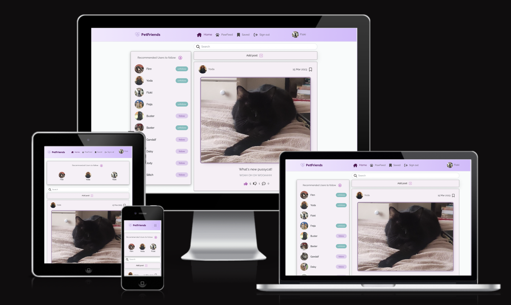

A live version of this website will be found here: https://pet-friends.herokuapp.com/

* Deployed FrontEnd - https://pet-friends.herokuapp.com/

* Deployed BackEnd API - https://petfriends-api.herokuapp.com/

* BackEnd Repo - https://github.com/JodyMurray/my-api.git

* FrontEnd Repo - https://github.com/JodyMurray/petfriends.git

## **Table of Contents** ##

UX

- [User Demographic](#user-demographic "User Demographic")
- [Site Goals](#site-goals "Site Goals")
- [User Goals](#user-goals "User Goals")
- [Audience](#audience "Audience")
- [User Stories](#user-stories "User Stories")

Design

- [Colour Scheme](#colour-scheme "Colour Scheme")
- [Typography](#typography "Typography")
- [Iconography](#iconography "Iconography")
- [Wireframes](#wireframes "Wireframes")
- [Images](#images "Images")

Features

- [NavBar](#navbar "NavBar")
- [Home Landing Page](#home-landing-page "Home Landing Page")
- [Post Page](#post-page "Post Page")
- [About Page](#about-page "About Page")
- [PawFeed](#pawfeed "PawFeed")
- [Saved](#saved "Saved")
- [Profile Page](#profile-page "Profile Page")
- [Sign-in](#sign-in "Sign-in")
- [Sign-up](#sign-up "Sign-up")
- [No results found](#no-results-found "No results found")
- [CRUD](#crud "CRUD")
- [Defensive Design](#defensive-design "Defensive Design")

Technologies Used

- [Languages Used](#languages-used "Languages Used")
- [Frameworks, Libraries & Programs Used](#framewords-libraries-and-programs-used "Frameworks, Libraries & Programs Used")
- [Databases platform and cloud storage](#databases-platform-and-cloud-storage "Databases platform and cloud storage")
- [Relational Database Diagram](#relational-database-diagram "Relational Database Diagram")
- [Database Structure](#database-structure "Database Structure")

Testing

- [Introduction](#introduction "Introduction")
- [Validator testing](#validator-testing "Validator Testing")
- [Automated testing](#automated-testing "Automated Testing")
- [Testing and bugs](#testing-and-bugs "Testing and bugs")
- [Fixed Bugs and Solutions](#fixed-bugs-and-solutions "Fixed Bugs and Solutions") 
- [Unfixed Bugs](#unfixed-bugs "Unfixed Bugs")
- [Future plans to implement](#future-plans-to-implement "Future plans to implement")

Credits

- [Acknowledgements](#acknowledgements "Acknowledgements")
- [Sources](#sources "Sources")
- [Media](#media "Media")

------------------------------------------------------------------------------------------------------------

## **UX**

### **User Demographic**

This application has been designed for pets of all kinds who want to share content and make some friends!
Mkae your pet a profile, add a post and start interacting with fellow domesticated animals! 

### **Site Goals**

To build a content sharing platform to allow users to make profiles for their pets, add posts, follow and unfollow other users, vote or downvote posts, as well as save them, and comment on posts too! You can use the provided search bar to search through the posts with a keyword or a user's name. 

### **Audience**

For your pets! Especially those looking to make new friends.

### **User Stories**
User Stories and Backend Tasks can be found in this GitHub repository project Kanban board, and for this project, all user stories can be found [here](https://github.com/users/JodyMurray/projects/11)

## **Design**

### **Colour Scheme**
The colour scheme chosen, was decided from looking up trending colour schemes online from this website 
[(https://coolors.co/palettes/trending)]
- The colour for the NavBar is a linear-gradient (to right, rgba(241, 231, 254), rgba(213, 184, 255))
- The colour for the content boxes is rgb(246, 239, 245)
- The colour for the downVotes and saved icons in posts is rgb(7, 108, 108)
- The colour for headings in the signup/in page is #7a21b2
- The colour for the "light" buttons is #7a21b2, #ddc6ec
- The colour for the unfollow button is rgb(139, 227, 218)

### **Typography**

All fonts are from the Google Fonts library.The following fonts were chosen for the page:
- 'Hanken Grotesk', sans-serif for the headers in the SignInUpForms.
- 'Raleway', sans-serif for the rest of the font on the page.

### **Iconography**

The logo used for this project was made using [Looka](https://looka.com/explore).

### **Wireframes**

Wireframe for home page/feed:

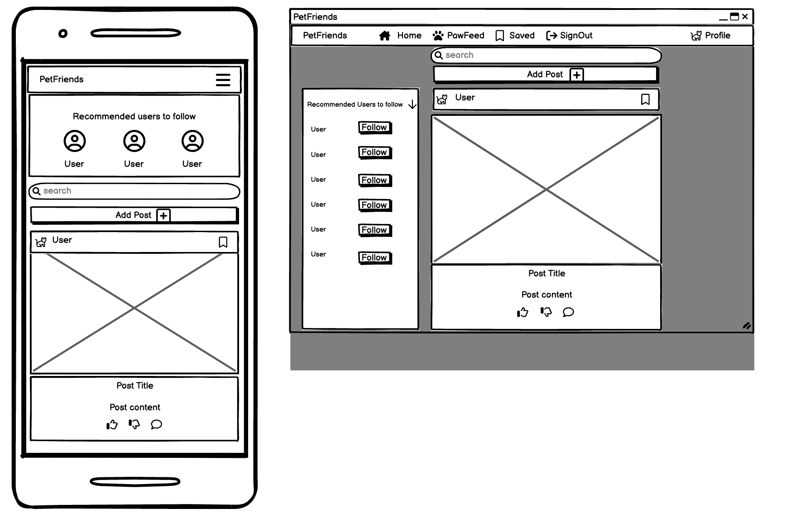
 
 

Wireframe for post page:

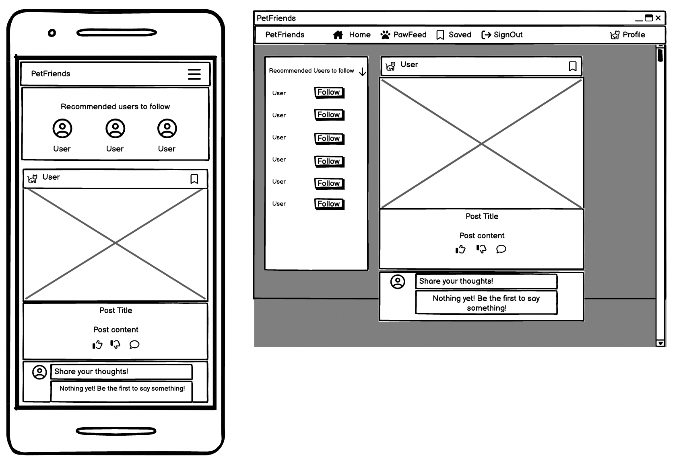
 
 

Wireframe for profile page:

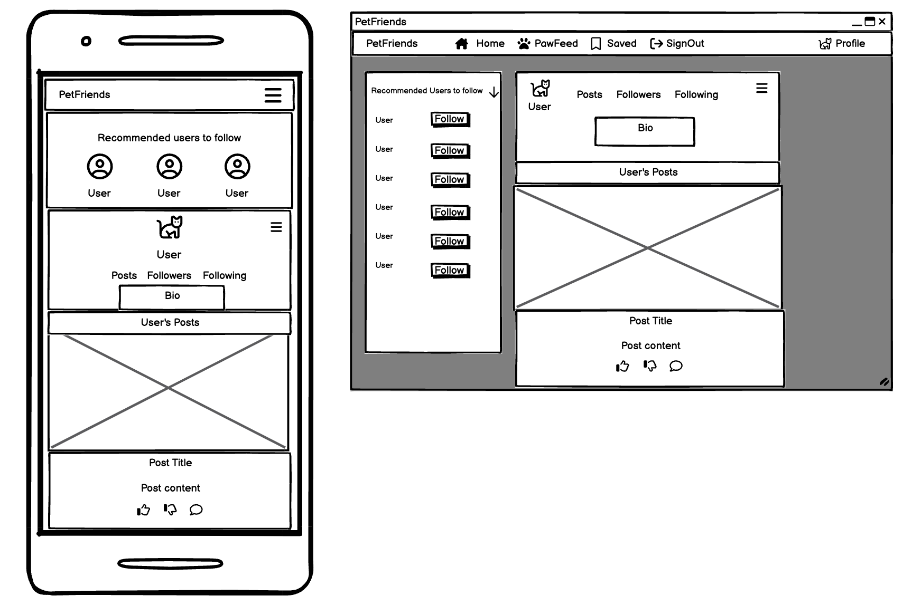
 
 

Wireframe for add post page:

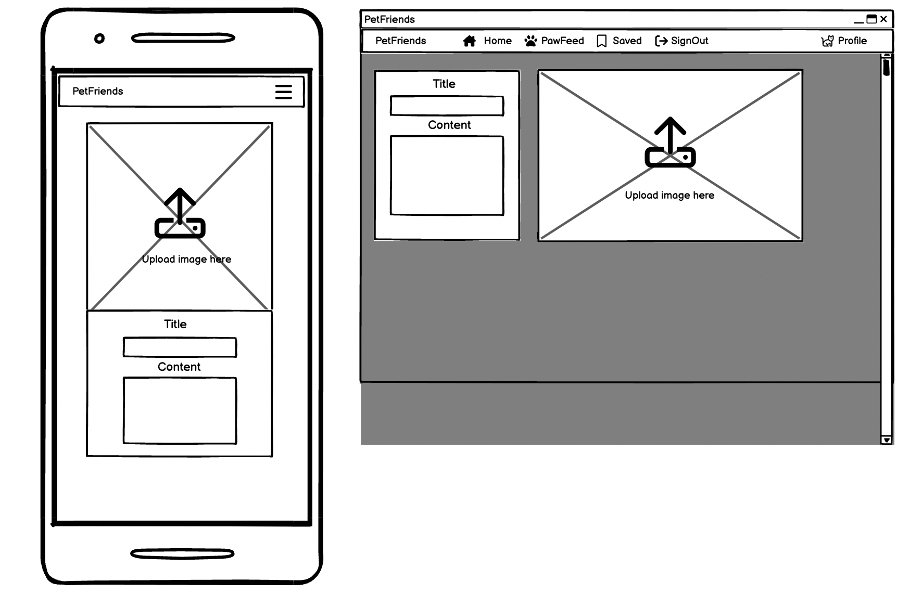
 
 

### **Images**

All images for the websites pages were sourced through google and stored on Cloudinary.

The images used for the posts and pet's profiles were sourced from google, but mostly from pets I live with (Yoda) and my friend's pets. 

## **Features**

### **NavBar**
NavBar, user not logged in.

NavBar, user loggeed in.

### **Home Landing Page**

The home screen and landing page, with the recommended profiles sidebar.

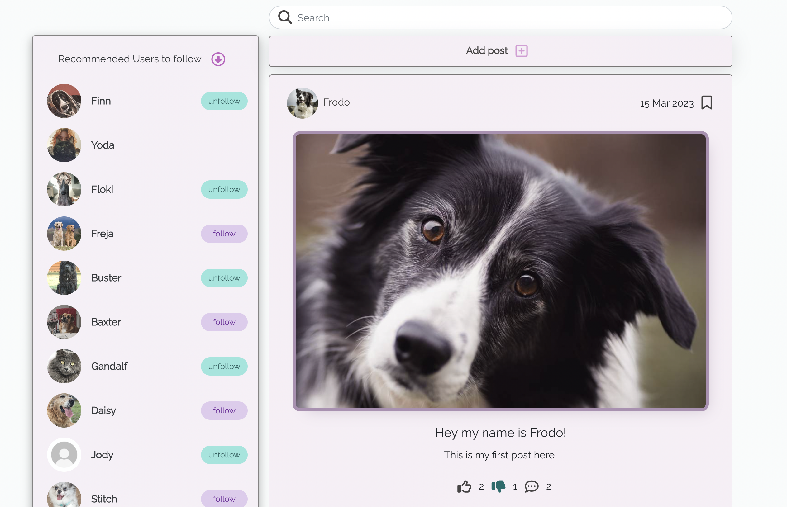

### **Post Page**

The post's page, with the recommended profiles sidebar.
Thumbs up and thumbs down buttons to upvote or downvote any post to your desire.
The three dots on the side of the post image is the button to edit or delete your post.

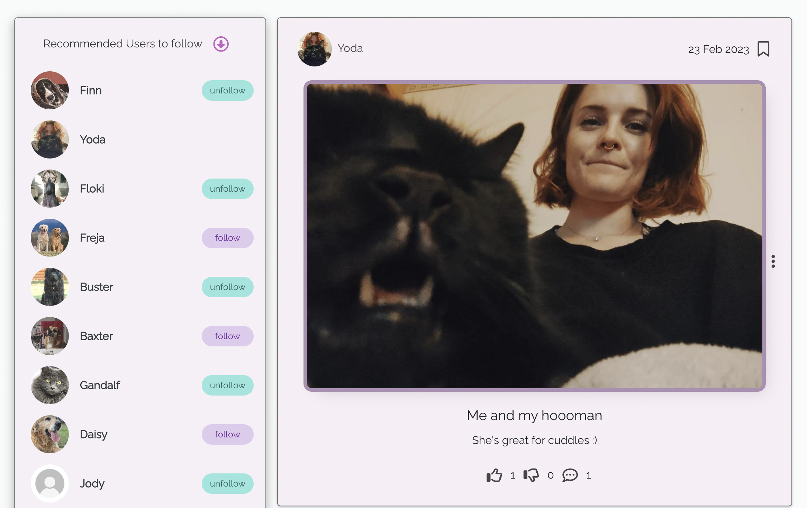
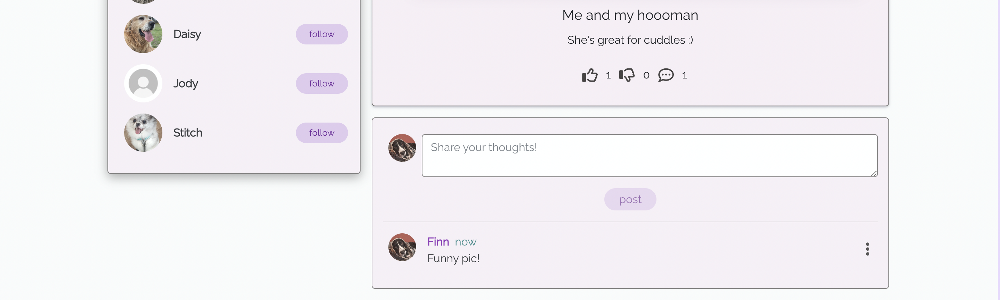

### **About Page**

Just a little paragraph about the site! This page only shows up in the NavBar if you are not signed in.

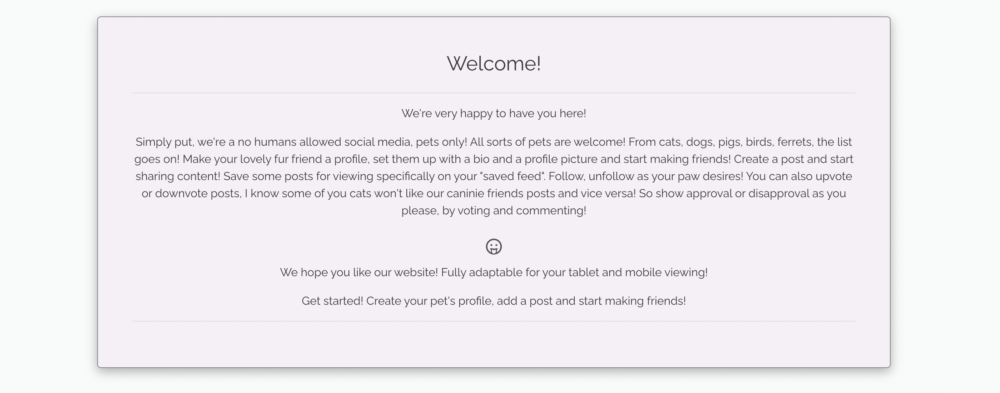

### **PawFeed**

The PawFeed consist of posts from users that you follow.

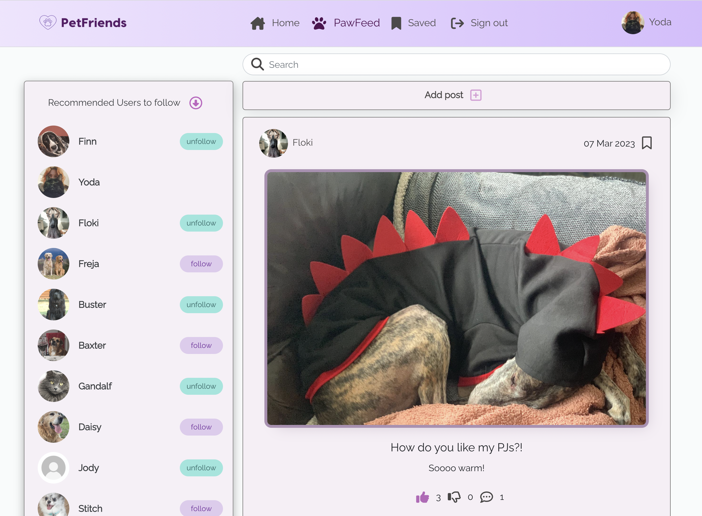

### **Saved**

The saved page consists of posts you have specifically saved.

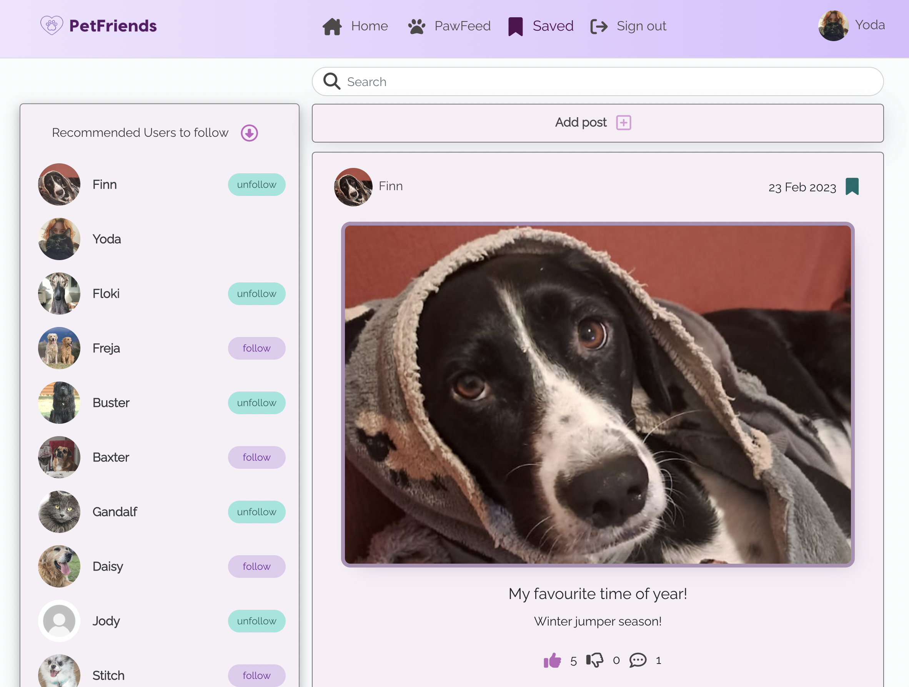

### **Profile Page**

Your profile page, or another user's, along with the sidebar of recommended profiles to follow. 
The profile page contains a bio section, the bars in the corner to edit your profile, change your username or password.

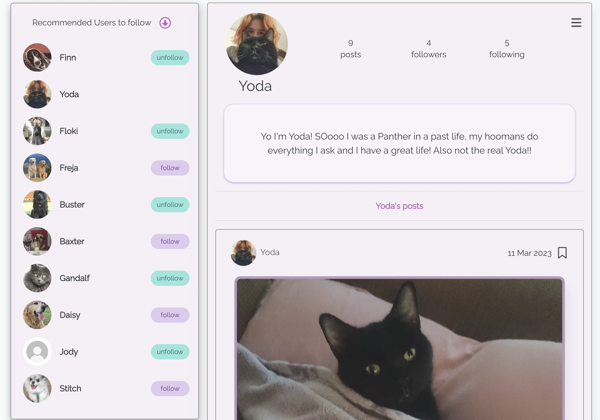

### **Sign-in**

Sign-in page, along with a link to sign up for an account if you haven't already!

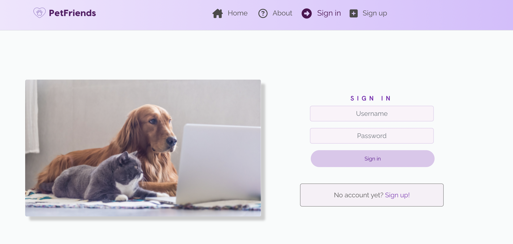

### **Sign-up**

Sign-up page, along with a link to sign in if you have an account already!

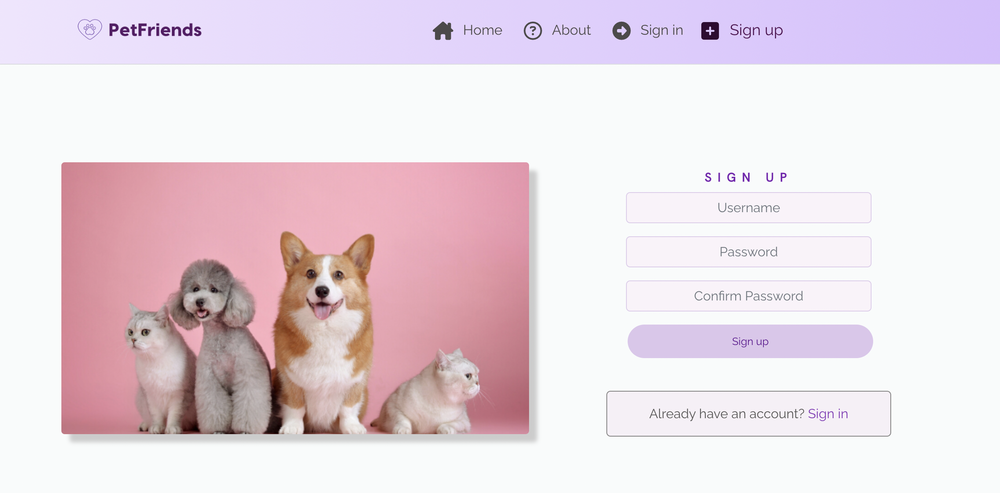

### **CRUD**
