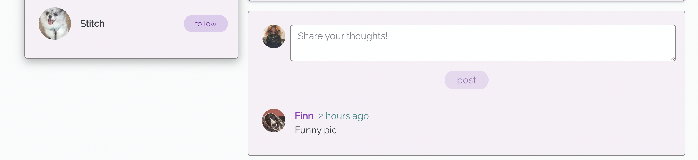
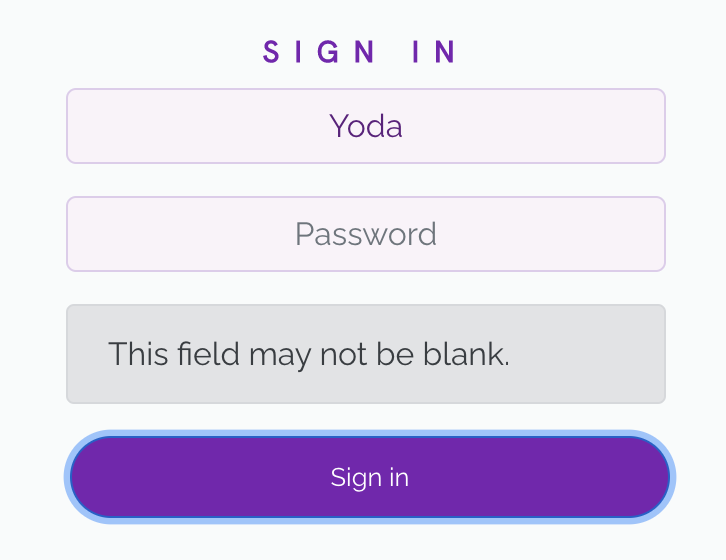

# **PetFriends**

This is a website for pets only! We have here a social media for pets. We can make our beloved pets a profile so they can post silly photos of themselves and follow, vote (or downvote) and comment on other pet's profiles! Saving posts is even possible. All pets welcome! From cats, dogs, hedgehogs, lizards and so on. The site is a content sharing platform, which, once you sign up, you will be redirected to sign in and then redirected to the home page/main feed. From there you can click on your profile icon in the top right of the NavBar and see your profile stats (once you gain some), see your posts, and click on the bars to edit your profile, password and username. Personalise your pet's profile with a picture and a bio, a little bit about your pet!

Once your pet follows a few profiles, you'll be able to see said followed profiles in the "pawfeed" section from the NavBar. The NavBar also contains a "saved" section, which allows you to see posts that you (your pets) specifically saved.

There is a sidebar featured on the posts and profile pages, to show the popular pets profiles and suggested "recommended users to follow". 

Once you're on the homepage, you can "add post", you can also use the search bar above the "add post" section to search through all posts using a keyword or a user's name. 
The three dots on the side of your post allow you to edit or delete your own posts, and the same goes for comments you've written on posts.

This project is the final of five projects that needs to be completed in order to receve a diploma in Software Development from The Code Institute.

## Responsive screen display

A live version of this website will be found here: https://pet-friends.herokuapp.com/

* Deployed FrontEnd - https://pet-friends.herokuapp.com/

* Deployed BackEnd API - https://petfriends-api.herokuapp.com/

* BackEnd Repo - https://github.com/JodyMurray/my-api.git

* FrontEnd Repo - https://github.com/JodyMurray/petfriends.git

## **Table of Contents** ##

UX

- [User Demographic](#user-demographic "User Demographic")
- [Site Goals](#site-goals "Site Goals")
- [Audience](#audience "Audience")
- [User Stories](#user-stories "User Stories")

Design

- [Colour Scheme](#colour-scheme "Colour Scheme")
- [Typography](#typography "Typography")
- [Iconography](#iconography "Iconography")
- [Wireframes](#wireframes "Wireframes")
- [Images](#images "Images")

Features

- [NavBar](#navbar "NavBar")
- [Home Landing Page](#home-landing-page "Home Landing Page")
- [Post Page](#post-page "Post Page")
- [About Page](#about-page "About Page")
- [PawFeed](#pawfeed "PawFeed")
- [Saved](#saved "Saved")
- [Profile Page](#profile-page "Profile Page")
- [Sign-in](#sign-in "Sign-in")
- [Sign-up](#sign-up "Sign-up")
- [No results found](#no-results-found "No results found")
- [CRUD](#crud "CRUD")
- [Defensive Design](#defensive-design "Defensive Design")
- [Future Implementations](#future-implementations "Future Implementations")
- [Components and Pages](#components-and-pages "Components and Pages")

Technologies Used

- [Languages Used](#languages-used "Languages Used")
- [Frameworks, Libraries and Programs Used](#frameworks-libraries-and-programs-used "Frameworks, Libraries and Programs Used")
- [Databases platform and cloud storage](#databases-platform-and-cloud-storage "Databases platform and cloud storage")

Testing

- [Introduction](#introduction "Introduction")
- [Validator testing](#validator-testing "Validator Testing")
- [Manual Testing](#manual-testing "Manual Testing")
- [Fixed Bugs and Solutions](#fixed-bugs-and-solutions "Fixed Bugs and Solutions") 
- [Unfixed Bugs](#unfixed-bugs "Unfixed Bugs")
- [Future plans to implement](#future-plans-to-implement "Future plans to implement")

Deployment

- [GitHub](#github "GitHub")
- [Heroku](#heroku "heroku")

Credits

- [Acknowledgements](#acknowledgements "Acknowledgements")
- [Sources](#sources "Sources")
- [Media](#media "Media")

------------------------------------------------------------------------------------------------------------

## **UX**

### **User Demographic**

This application has been designed for pets of all kinds who want to share content and make some friends!
Mkae your pet a profile, add a post and start interacting with fellow domesticated animals! 

### **Site Goals**

To build a content sharing platform to allow users to make profiles for their pets, add posts, follow and unfollow other users, vote or downvote posts, as well as save them, and comment on posts too! You can use the provided search bar to search through the posts with a keyword or a user's name. 

### **Audience**

For your pets! Especially those looking to make new friends.

### **User Stories**
User Stories and Backend Tasks can be found in this GitHub repository project Kanban board, and for this project, all user stories can be found [here](https://github.com/users/JodyMurray/projects/11)

## **Design**

### **Colour Scheme**
The colour scheme chosen, was decided from looking up trending colour schemes online from this website 
[coolers](https://coolors.co/palettes/trending).
- The colour for the NavBar is a linear-gradient (to right, rgba(241, 231, 254), rgba(213, 184, 255))
- The colour for the content boxes is rgb(246, 239, 245)
- The colour for the downVotes and saved icons in posts is rgb(7, 108, 108)
- The colour for headings in the signup/in page is #7a21b2
- The colour for the "light" buttons is #7a21b2, #ddc6ec
- The colour for the unfollow button is rgb(139, 227, 218)

### **Typography**

All fonts are from the Google Fonts library. The following fonts were chosen for the page:
- 'Hanken Grotesk', sans-serif for the headers in the SignInUpForms.
- 'Raleway', sans-serif for the rest of the font on the page.

### **Iconography**

The logo used for this project was made using [Looka](https://looka.com/explore).

### **Wireframes**

Wireframe for home page/feed:

 
 

Wireframe for post page:

 
 

Wireframe for profile page:

 
 

Wireframe for add post page:

 
 

### **Images**

All images for the websites pages were sourced through google and stored on Cloudinary.

The images used for the posts and pet's profiles were sourced from google, but mostly from pets I live with (Yoda) and my friend's pets. 

## **Features**

### **NavBar**
NavBar, user not logged in.

NavBar, user logged in.

### **Home Landing Page**

The home screen and landing page, with the recommended users to follow sidebar.

### **Post Page**

- The post's page, with the recommended user to follow sidebar.
- Thumbs up and thumbs down buttons to upvote or downvote any post to your desire.
- On the top right of the post beide the date posted, you have a bookmark icon to save this post, which later you can view in the "Saved" section from the NavBar.
- The three dots on the side of the post image is the button to edit or delete your post.
- And the comment section, create, edit and delete your comments!

### **About Page**

Just a little paragraph about the site! This page only shows up in the NavBar if you are not signed in.

### **PawFeed**

The PawFeed consist of posts from users that you follow.

### **Saved**

The saved page consists of posts you have specifically saved.

### **Profile Page**

- Your profile page, or another user's, along with the sidebar of recommended profiles to follow. 
- The profile page contains a bio section, the bars in the corner to edit your profile, change your username or password.
- The page also holds all of the posts that the owner of the page has added.

### **Sign-in**

Sign-in page, along with a link to sign up for an account if you haven't already!

### **Sign-up**

Sign-up page, along with a link to sign in if you have an account already!

### **No results found**
#### The "No results image" will appear when:

* The search bar entry does not exist:

* An invalid HTTP request is made:

* On the user's profile page, if no posts have been added yet:

### **CRUD**
The CRUD functionality for this project are as follows:

* The user can, once signed up to an account, update their profile with a profile picture/bio. They can also update their username and password from the profile page.
* The user can also, once a post has been created, update or delete their post. The three dots on the right of the post's image will either delete the post (and bring you back to the home page once this is done) or edit your post, bringing you to an edit post form.
* Users can also, once created a comment on a post, delete or edit their comments. If chosen, editing a comment will bring up a small form to retype your comment and then you can either save or close if you change your mind.
* Users can also upvote, downvote and/or save posts, and you can also undo all of these features if you changed your mind.
* Users can also follow other user's accounts, and following this, unfollow if they desire.

### **Defensive Design**

* When making a new account, the following message will appear if any of the inputs are left blank:

* Login attempts with the wrong credentials, will show the following message: 

* Login attempts leaving any input blank, will show the following message: 

* Attempts to save or vote for your own posts will show the following messages: 

* In the edit feature of a user's own posts, found by clicking the three dots on the right side of the post's image on the post page, will show the following message to ensure you know what you're doing before you click:

 

* In the "Add post" section, leaving certain inputs blank will show the following message: 

### **Future Implementations**

- Add more fields for a user to add to their profile.
- Add a meow/bark feature, similar to "poke" on facebook, as an alert or notification.
- Add votes and downvotes count to profile stats.
- Add feature to allow users to see who voted for their posts.

## **Components and Pages**
### **Components**
* Asset.js - component for the spinner seen while the page is loading, used in PostFeed.js, PostsFeed.js, PopularProfiles.js & ProfilePage.js files.

* Avatar.js - component used for displaying of the profile image. Used in NavBar.js, Post.js, Profile.js, ProfilePage.js, Reply.js, ReplyCreateForm.js files.

* MoreDropdown.js - component used for the functionality and display of the icons to edit/delete posts, comments and profiles. Only shown to the owner of such posts and their profiles.

* NavBar.js - component used for the display of the NavBar, added into the main app.js file to display at the top of the page.

* NotFound.js - component used for displaying an error image and message if an invalid page has been typed in.

### **Pages**

## **Technologies Used**
### **Languages Used**
- HTML
- CSS
- Javascript
- React

### **Frameworks, Libraries and Programs Used**
- [Axios](https://axios-http.com/): a promised-based HTTP client for JavaScript. It has the ability to make HTTP requests from the browser and handle the transformation of request and response data.
- [Favicon](https://favicon.io/): Used to generate the favicon image from a logo generated.
- [jwt-decode](https://jwt.io/): is an open standard (RFC 7519) for securely transmitting information between parties as JSON object.
- [React-Bootstrap](https://react-bootstrap.github.io/): a component-based library that provides native Bootstrap components as pure React components.
- [react-router-dom](https://www.npmjs.com/package/react-router-dom): enables you to implement dynamic routing in a web app. 
- [react-infinite-scroll-component](https://www.npmjs.com/package/react-infinite-scroll-component): a technique that automatically adds the next page as the user scrolls down through content, more content is loaded.
- [Font Awesome](https://fontawesome.com/): a widely-used icon set that gives you scalable vector images that can be customized with CSS.
- [Google Lighthouse](https://developer.chrome.com/docs/lighthouse/overview/): an open source tool for running technical website audits.
- [Am I Responsive?](https://ui.dev/amiresponsive): to ensure the project looked good across all devices.
- [HTML Markup Validation](https://validator.w3.org/): used to validate HTML code syntax.
- [CSS Validation Service](https://jigsaw.w3.org/css-validator/): used to validate CSS code syntax.
- [Balsamiq](https://balsamiq.com/): used to create mockups/wireframes of the project prior to starting.
- [Google Fonts](https://fonts.google.com/): a computer font and web font service owned by Google. This includes free and open source font families.
- [GitHub](https://github.com/): an Internet hosting service for software development and version control using Git.
- [Heroku](https://heroku.com/): a cloud platform as a service (PaaS) supporting several programming languages. Used to 
deploy and store for final deployment.

### **Databases platform and cloud storage**

- ElephantSQL Postgres: database service provided by ElephantSQL for data storage.
- Heroku Postgres: SQL database service provided directly by Heroku for storing data.
- Cloudinary: to store images and static files in production.
- Heroku: to deploy and run the application in production.

## **Testing**
### **Introduction**
This project has been continuously tested throughout development stages using the following features:
- Python terminal for backend functionalities
- Google Developer Tools
- Manual Testing
- Automated Testing

### **Validator Testing**
- All HTML files passed through the HTML checker with no errors, but with an info message to remove trailing slashes in the index.html.
- After removal of these slashes, there was no error/info message and everything passed.

- CSS files pass through the Jigsaw validator without error.

- All JSX code was validated and corrected throughout the development of the project.

#### **LightHouse testing**

* **For Desktop:**

    | Section | Performance | Accessibility | Best Practices | SEO |
    | --- | --- | --- | --- | --- |
    | Home | 73 | 100 | 92 | 100 |
    | PawFeed | 73 | 100 | 92 | 100 |
    | Saved | 73 | 100 | 92 | 100 |
    | Sign Up | 86 | 100 | 67 | 100 |
    | Sign in | 87 | 100 | 67 | 100 |
    | Profile | 83 | 100 | 92 | 100 |

* **For Mobile devices:**

    | Section | Performance | Accessibility | Best Practices | SEO |
    | --- | --- | --- | --- | --- |
    | Home | 51 | 100 | 92 | 100 |
    | PawFeed | 53 | 100 | 92 | 100 |
    | Saved | 51 | 100 | 92 | 100 |
    | Sign Up | 53 | 100 | 83 | 100 |
    | Sign in | 53 | 100 | 83 | 100 |
    | Profile | 51 | 100 | 92 | 100 |

### **Manual Testing**
Manual testing for this project were carried out as follows: 
- Users can see sign in, sign up and about pages only when not logged in.
- Users can create a new account.
- Users can then therefore sign in to their account and then be redirected to the home page.
- Users can log out.
- Once signed in, users can create, vote, save, comment on posts. They can edit and delete their posts and comments. 
- Users can edit and update their profiles, which includes a profile picture, bio entry and a separate username and password edit feature.
- All NavLinks and buttons go to their destination.
- Clicking on the post image brings you to the post's page.
- You can vote, downvote and save and also undo all of these actions if you change your mind.
- When votes/comments/save icons are hovered over, they let you know if you need to sign in to use this feature, and once clicked on if the user is signed out, you will be redirected to the signin page.
- The user is notified what each icon represents. In each post page, if the user is the owner, the three dots to the right side of the post image will bring up the edit and delete feature, both icons have an overlaytrigger to indicate which one does what feature.
- The site was continuously built on google chrome, and once built, it was sucessfully tested on firefox browswer, and safari browser. The only issue found on safari was the inability to signin properly, which was resolved after some research on Slack. (mentioned and detailed in fixed bugs section below) 

### **Fixed bugs and solutions**

- TokenTimestamp wasn't functioning as it should.
    * Solution: A spelling error fix solved the issue.

- Reply count unpon testing wasn't going up in count as a reply is added.
    * Solution: The variable was wrongly named "replies_count", resolved once renamed "reply_count".

- For smaller screen sizes, the navlink's text and icons stacked on top of each other.
    * Solution: Reduce padding, size of font and reduce margin on the logo as it was pushing everything to the right.

- An error logged to the console for the logo/favicon image. 
    * Solution: I had deleted the original favicon.io 16x16 images when I first opened the project, adding these back with. the new logo resolved this error.

- Errors would show up in the console claiming that there were several icons with "class" instead of "className" 
obviously from copying and pasting from font awesome.
    * Solution: Searching all icons in the sidebar on github, this was quicky resolved.

- When the reply icon was clicked on, the page wasn't redirecting to the reply section on the post page.
    * Solution: There was an unnecessary space in the link - {posts/$id}.

- There was an issue with logging in through safari, once I added the credentials it would jump back to the signin page.
    * Solution: Upon researching in Slack, the issue was with the JWT json web token as a http-only cookie in the browser,
    in the settings in Safari, enabling "Allow cross-website tracking" resolved the issue and it was possible to sign-in.

## **Deployment**

### **GitHub**
The following bullet points detail the steps gone through to set up this project on GitHub:
- Create Repository on GitHub (Not using any Code Institue Template).
- Create a new workspace. Once workspace has started, run the following command in the terminal window:

    *npx create-react-app . --template git+https://github.com/Code-Institute-Org/cra-template-moments.git --use-npm*

- Enter "y" to confirm nstalling the create-react-app package.
- Once the packages have been installed, run *npm start* to check that react is working correctly.
- Once you can see it's running efficiently, go into the App.js file and remove the React Custom header and replace with a test text "Hello, world!", and remove the logo import at the top of the page.
- In the preview window, you should see the test text show up now.
- Once you see this test text, add, commit and push your changes.

### **Heroku**
The following bullet points detail the steps gone through to set up this project on Heroku:
- In heroku: Click on the "new" button and follow the steps to create a new app, noting that a completely unique name is required.
- Once your unique name is chosen and you've selected your appropriate region, click "Create app".
- Once this app is created, in the "deploy" tab in Heroku, you can connect this to your github repo.
- From "Deployment method" section, choose github, and enter the name of the repo just created and use the search feature to find it and then click "connect".
- When you've successfully connected your repo. Go to 'Manual Deploy' section and click 'Deploy Branch'. Click on 'build logs' to monitor build and ensure deployment is successful. Build is completed when the log says 'Build succeeded!'.
- Next step is to install Bootstrap 4, by typing the following command in the terminal window:

    *npm install react-bootstrap@1.6.3 bootstrap@4.6.0*

## **Credits**

- The Moments walkthrough was used as a guide for this project, it served as a major help in creating this site.
- My mentor at Code Institute - Martina Terlevic.
- Keiron Chaudhry, a fellow student and great support!

- Extra big thank you to Code Institute for this entire course, it's been a great journey so far, the tools and support provided during this course were amazing!

## **Sources**

- The Moments walkthrough was the main source I used as a guide for this project.
- Slack - was a major help in solving some issues I came across.
- StackOverflow - another major help in solving issues I came across building this project.

## **Media**

- The media sourced for this website, were mostly found on Google.
- Other images were from friends and family, photos of their pets. And my own pet's images also.
- The logo was generated using a logo generator from this website - [Looka](https://looka.com/)
- The background remover tool was very useful to help with the logo and favicon - [here](https://www.remove.bg/)
- The image for favicon was generated through - [favicon.io](https://favicon.io/)
- The image for the responsive design at the top of the ReadMe was generated through - 
[am i responsive?](https://ui.dev/amiresponsive)

